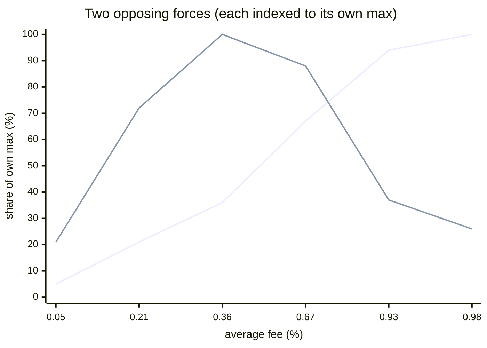
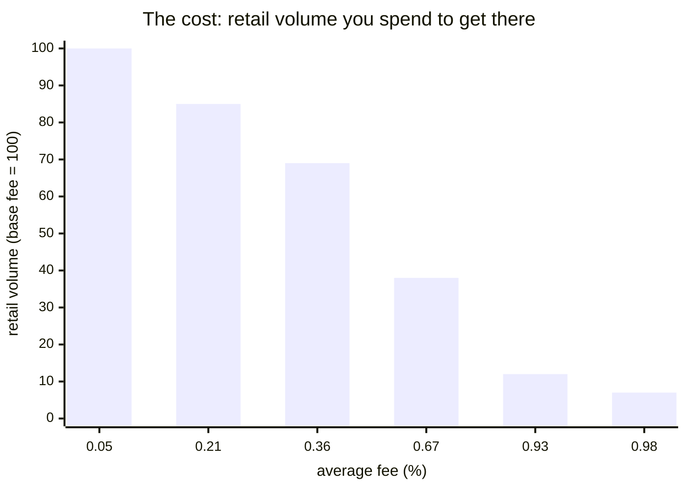

# LVR-minimizing dynamic-fee hook


A Uniswap **v4 hook** that sets the LP fee from the pool's own realized volatility, to reduce
**loss-versus-rebalancing (LVR)** — the volatility tax passive liquidity providers pay to arbitrageurs.

## The problem: passive LPs pay a volatility tax called LVR

An AMM quotes from a curve, not from the market. Between trades its price is **stale**, and informed
arbitrageurs continuously trade against that stale price to realign the pool with the outside market —
moving value out of the pool and into their pockets. Formalized, this is **Loss-Versus-Rebalancing**
(Milionis–Moallemi–Roughgarden–Zhang, 2022), the closest thing AMMs have to a Black-Scholes model of
LP returns.

LVR is not impermanent loss. IL is a snapshot versus holding and unwinds if the price returns; LVR is
**path-dependent, monotonically accumulating, and always positive**. Its defining property is that it
scales with the **square of volatility**:

```
LVR rate (constant-product, normalized to pool value) = σ² / 8
```

Double the volatility and the tax quadruples. For ETH/USDC at 5%/day that is ~3.125 bps/day, about
**11% of the position per year** bled to arbitrageurs. The empirical record is worse than the theory
sounds: arbitrage losses **exceed LP fee income in many of the largest Uniswap pools** (Fritsch &
Canidio, 2024), roughly **half of Uniswap v3 LPs underperform simply holding**, and IL/LVR dominated
fees in **~80%** of pools studied (Loesche et al., 2022). An LP is, in options terms, **short gamma,
long theta** — short volatility — and a fixed fee tier does nothing to price that exposure.

## Why a static fee cannot solve it

A swap fee is the LP's only defense: a proportional fee creates a **no-arbitrage band**, so
arbitrageurs only trade once the mispricing exceeds the fee, and the value they extract *decreases* as
the fee rises. The catch is that the **optimal fee grows with volatility** — it should be wide exactly
when the market is moving and LVR is high, and tight when the market is calm and the flow is mostly
benign retail. Uniswap v3's fixed tiers (0.05% / 0.30% / 1.00%) cannot track this: set the tier low
and arbitrageurs strip the pool during every volatile window; set it high and you overcharge the
retail flow that is the LP's only reliable source of profit. A single number is always wrong somewhere.

## What this hook does

`LVRMinimizingFeeHook` estimates volatility on-chain from the pool's price observations and, in
`beforeSwap`, sets a fee that widens the no-arbitrage band precisely when LVR is highest:

```
fee(σ̂) = clamp(baseFee + slope · σ̂², minFee, maxFee)
```

The fee is **linear in variance**, mirroring the σ² shape of LVR itself, so it tracks the cost it is
meant to offset. More of the arbitrage value stays in the pool as fees; retail keeps paying near the
floor in calm markets. It is a **composable overlay** — it attaches to an ordinary v4 pool, changing a
fee, not the curve — deliberately unlike mechanism-level redesigns (FM-AMM, CoW AMM, Diamond) that
recapture more LVR but require migrating liquidity into a new venue.

### What it is not

The hook **compensates** LVR by returning value to LPs as fees; it does not **eliminate** the
stale-price arbitrage the way a batch auction does. The volatility estimate is derived from a
manipulable on-chain price, so it is clamped and smoothed. And inter-block CEX–DEX arbitrage — the
largest slice of LVR — is not addressable by a per-swap fee alone. This repo is honest about that
boundary and **measures how much of the gap the fee closes** rather than claiming to close all of it.

## Architecture

```
src/
  LVRMinimizingFeeHook.sol      hook: dynamic-fee guard + beforeSwap override + afterSwap observation
  libraries/
    FeeCurve.sol                pure σ̂² -> fee: clamp(base + slope·variance, min, max)
    RealizedVolatility.sol      EWMA of squared tick returns, per-block clamp (manipulation guard)
  interfaces/ILVRFeeHook.sol
script/Deploy.s.sol             HookMiner address mining + CREATE2 deploy
test/
  unit/                         FeeCurve, RealizedVolatility, hook wiring (real PoolManager)
  invariant/                    fee bounds hold across 128k random swaps/rolls
  sim/                          LVR simulation: price path + arbitrageur + retail + stats
  fork/                         seeded by live mainnet pools (ETH_RPC_URL-gated)
```

The hook is built on OpenZeppelin's `BaseOverrideFee` (per-swap fee override) plus a per-pool
volatility observation updated after each swap. It requires a **dynamic-fee pool** — `afterInitialize`
reverts otherwise — and every callback is `onlyPoolManager`.

## Results

The claim "a volatility-indexed fee improves LP outcomes" is quantitative, so the centerpiece is a
**simulation harness** that measures **both sides** of the fee. Retail in the sim is **fee-elastic** —
it trades less as the fee rises — which is what turns the fee into a genuine tradeoff rather than free
money.

### What actually matters: LP net vs rebalancing

Fee revenue is only a proxy. The quantity that decides whether an LP should provide liquidity is **net
PnL vs a rebalancing benchmark = fees − LVR** (the canonical measure), reported as basis points of LP
capital (high-volatility regime):

| | LVR extracted | **LP net vs rebalancing** |
|---|---:|---:|
| static 0.05% | 36 bps | **−36 bps** |
| dynamic | 0.2 bps | +0.9 bps |

A static-fee LP is **net-negative** — LVR dwarfs fee income, the well-known "most passive LPs lose to
arbitrageurs" result — and the fee neutralizes it. **Caveat:** the simulated arbitrageur is currently
fee-inelastic, so the dynamic figure is an *upper bound* (a rational arb trades less and leaves the
pool mispriced); the sign is robust, the magnitude is being refined. Method and caveats:
[`docs/RESULTS.md`](docs/RESULTS.md).

### The tradeoff: there is an optimal fee, not "max fee"

Fix the volatility and crank the fee's aggressiveness. LP revenue splits into two opposing forces
(`test/sim/test_feeAggressivenessSweep`, x-axis = the average fee it produces):





- **Rising line — recapture from arbitrageurs.** A wider fee keeps more of the LVR in the pool; this
  grows monotonically with the fee.
- **Humped line — fee revenue from retail.** This is a **Laffer curve**: it peaks near **~0.35%** and
  then *falls*, because past that point the fee scares off retail volume faster than the higher rate
  makes up for it. The bar chart is that lost volume — down ~93% by the time the fee hits the cap.

So the fee has a **sweet spot** (here ≈ 0.3–0.5%): aggressive enough to claw back arbitrage LVR, not so
aggressive it kills the retail franchise. Turning the fee to the max is the wrong move — the volatility
index is only useful if it's *tuned*, and the harness is what sizes it. (The `slope`/`maxFee`
parameters are exactly this dial.)

### Where it pays off: volatile pools, not stable ones

Sweeping the pool's volatility instead of the fee (matched static-vs-dynamic, seeded by **live mainnet
pools** in the fork suite):

| Pool / regime | LP fees static → dynamic | LP lift | Avg retail fee (dyn) |
|---|---|---:|---:|
| USDC/USDT — stable | 0.0149 → 0.0167 | **1.1×** | 0.057% |
| ETH/USDC — mid | 0.0861 → 0.4116 | 4.8× | 0.249% |
| WBTC/ETH — volatile | 0.1526 → 1.9986 | **13.1×** | 0.673% |

The hook earns its keep in volatile, arbitrage-heavy pools and is **near-neutral in stable ones** —
low volatility pins the fee at the floor, so retail there still pays ~the base fee. No benefit and no
harm where there is no LVR to recapture. Full tables, method and caveats:
[`docs/RESULTS.md`](docs/RESULTS.md).

## Running the tests

Unit, invariant and simulation tests run fully offline (no RPC):

```bash
forge test --no-match-path "test/fork/*"
```

The fork tests replay the comparison seeded by real mainnet pools and need an Ethereum RPC:

```bash
cp .env.example .env         # then set ETH_RPC_URL to any mainnet endpoint
forge test --match-path "test/fork/*"
```

`foundry.toml` maps the `mainnet` alias to `${ETH_RPC_URL}`; the key stays in the gitignored `.env`
and is never committed. Any provider works (dRPC, Alchemy, Infura, …).

## Deploying

```bash
POOL_MANAGER=<v4 PoolManager> forge script script/Deploy.s.sol --rpc-url <rpc> --broadcast
```

The script mines a hook address whose low bits encode the permission set
(`afterInitialize | beforeSwap | afterSwap`) and deploys via the canonical CREATE2 deployer.

## Security

Experimental, unaudited. Trust assumptions and residual risks are in
[`docs/THREAT_MODEL.md`](docs/THREAT_MODEL.md); reporting in [`SECURITY.md`](SECURITY.md).

## License

[MIT](LICENSE).
