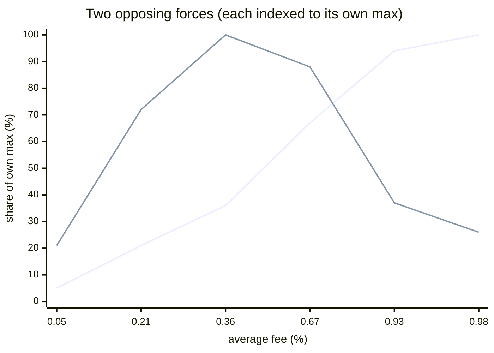
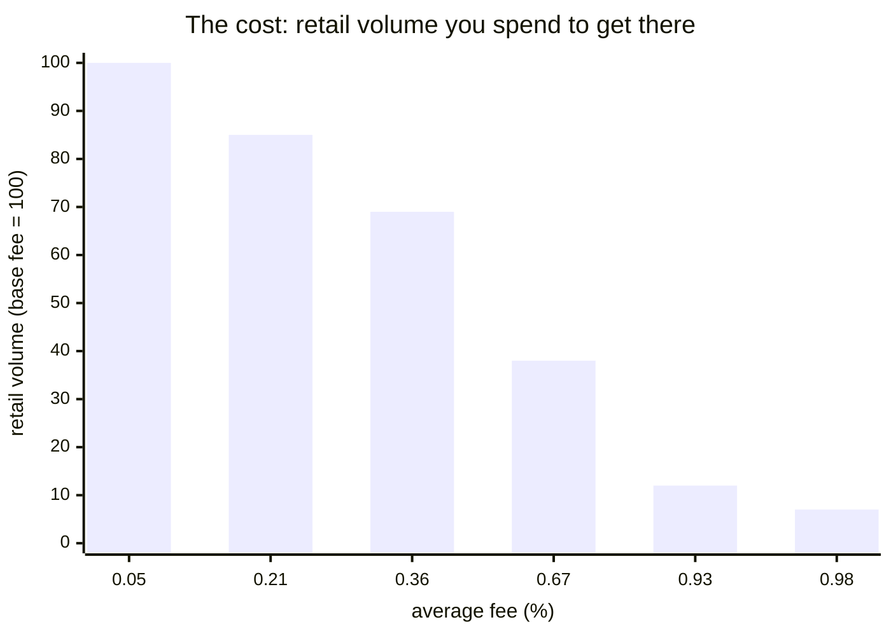
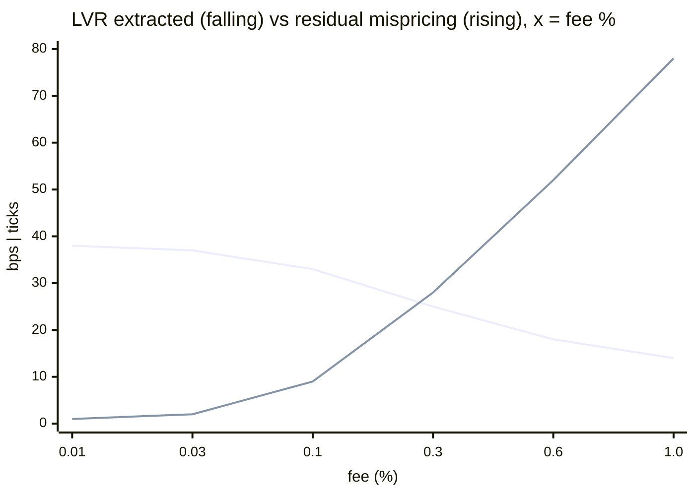
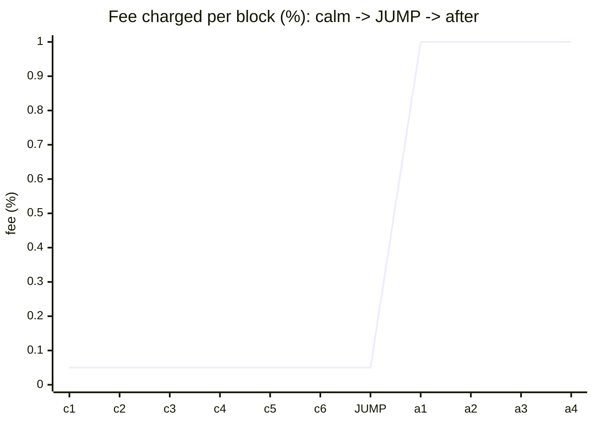
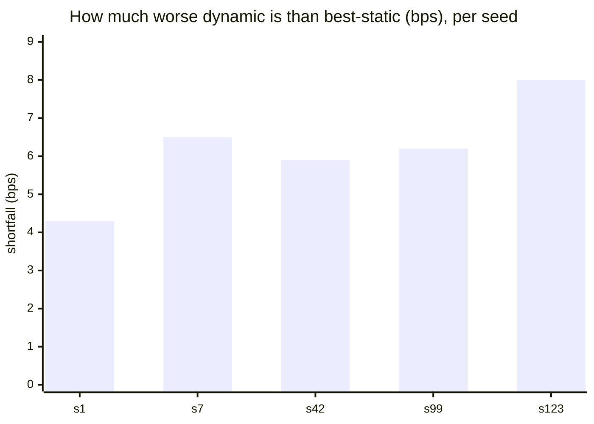

# LVR-minimizing dynamic-fee hook


A Uniswap **v4 hook** that sets the LP fee from the pool's own realized volatility to fight
**loss-versus-rebalancing (LVR)** — the volatility tax passive liquidity providers pay to arbitrageurs
— *and a rigorous, self-critical evaluation of whether a volatility-indexed fee actually works.*

> **Bottom line up front.** Built as designed and measured honestly (rational arbitrageur, LP net vs a
> rebalancing benchmark), the hook **reduces the LVR arbitrageurs extract but does not beat a well-tuned
> static fee** — and it loses on every one of 5 Monte-Carlo seeds. The reason is structural: a
> backward-looking EWMA is *one block late* (a jump pays 0.05% while the deterrent 1% fee arrives the
> block after). The real value here is the **measurement framework** and **composability** (an overlay
> on any pool); the open problem is a **forward-looking** volatility signal. Full evidence below and in
> [`docs/RESULTS.md`](docs/RESULTS.md). This is the honest result, not the marketing one.

## The problem: passive LPs pay a volatility tax called LVR

An AMM quotes from a curve, not from the market. Between trades its price is **stale**, and informed
arbitrageurs continuously trade against that stale price to realign the pool with the outside market —
moving value out of the pool and into their pockets. Formalized, this is **Loss-Versus-Rebalancing**
(Milionis–Moallemi–Roughgarden–Zhang, 2022), the closest thing AMMs have to a Black-Scholes model of
LP returns.

LVR is not impermanent loss. IL is a snapshot versus holding and unwinds if the price returns; LVR is
**path-dependent, monotonically accumulating, and always positive**. Its defining property is that it
scales with the **square of volatility**:

```
LVR rate (constant-product, normalized to pool value) = σ² / 8
```

Double the volatility and the tax quadruples. For ETH/USDC at 5%/day that is ~3.125 bps/day, about
**11% of the position per year** bled to arbitrageurs. The empirical record is worse than the theory
sounds: arbitrage losses **exceed LP fee income in many of the largest Uniswap pools** (Fritsch &
Canidio, 2024), roughly **half of Uniswap v3 LPs underperform simply holding**, and IL/LVR dominated
fees in **~80%** of pools studied (Loesche et al., 2022). An LP is, in options terms, **short gamma,
long theta** — short volatility — and a fixed fee tier does nothing to price that exposure.

## Why a static fee cannot solve it

A swap fee is the LP's only defense: a proportional fee creates a **no-arbitrage band**, so
arbitrageurs only trade once the mispricing exceeds the fee, and the value they extract *decreases* as
the fee rises. The catch is that the **optimal fee grows with volatility** — it should be wide exactly
when the market is moving and LVR is high, and tight when the market is calm and the flow is mostly
benign retail. Uniswap v3's fixed tiers (0.05% / 0.30% / 1.00%) cannot track this: set the tier low
and arbitrageurs strip the pool during every volatile window; set it high and you overcharge the
retail flow that is the LP's only reliable source of profit. A single number is always wrong somewhere.

## What this hook does

`LVRMinimizingFeeHook` estimates volatility on-chain from the pool's price observations and, in
`beforeSwap`, sets a fee that widens the no-arbitrage band precisely when LVR is highest:

```
fee(σ̂) = clamp(baseFee + slope · σ̂², minFee, maxFee)
```

The fee is **linear in variance**, mirroring the σ² shape of LVR itself, so it tracks the cost it is
meant to offset. More of the arbitrage value stays in the pool as fees; retail keeps paying near the
floor in calm markets. It is a **composable overlay** — it attaches to an ordinary v4 pool, changing a
fee, not the curve — deliberately unlike mechanism-level redesigns (FM-AMM, CoW AMM, Diamond) that
recapture more LVR but require migrating liquidity into a new venue.

### What it is not

The hook **compensates** LVR by returning value to LPs as fees; it does not **eliminate** the
stale-price arbitrage the way a batch auction does. The volatility estimate is derived from a
manipulable on-chain price, so it is clamped and smoothed. And inter-block CEX–DEX arbitrage — the
largest slice of LVR — is not addressable by a per-swap fee alone. This repo is honest about that
boundary and **measures how much of the gap the fee closes** rather than claiming to close all of it.

## Architecture

```
src/
  LVRMinimizingFeeHook.sol      hook: dynamic-fee guard + beforeSwap override + afterSwap observation
  libraries/
    FeeCurve.sol                pure σ̂² -> fee: clamp(base + slope·variance, min, max)
    RealizedVolatility.sol      EWMA of squared tick returns, per-block clamp (manipulation guard)
  interfaces/ILVRFeeHook.sol
script/Deploy.s.sol             HookMiner address mining + CREATE2 deploy
test/
  unit/                         FeeCurve, RealizedVolatility, hook wiring (real PoolManager)
  invariant/                    fee bounds hold across 128k random swaps/rolls
  sim/                          LVR simulation: price path + arbitrageur + retail + stats
  fork/                         seeded by live mainnet pools (ETH_RPC_URL-gated)
```

The hook is built on OpenZeppelin's `BaseOverrideFee` (per-swap fee override) plus a per-pool
volatility observation updated after each swap. It requires a **dynamic-fee pool** — `afterInitialize`
reverts otherwise — and every callback is `onlyPoolManager`.

## Results

The claim "a volatility-indexed fee improves LP outcomes" is quantitative, so the centerpiece is a
**simulation harness** that measures **both sides** of the fee. Retail in the sim is **fee-elastic** —
it trades less as the fee rises — which is what turns the fee into a genuine tradeoff rather than free
money.

### What actually matters: LP net vs rebalancing

Fee revenue is only a proxy. The quantity that decides whether an LP should provide liquidity is **net
PnL vs a rebalancing benchmark = fees − LVR** (the canonical measure), reported as basis points of LP
capital (high-volatility regime):

| | LVR extracted | **LP net vs rebalancing** | Residual mispricing |
|---|---:|---:|---:|
| static 0.05% | 36 bps | **−36 bps** | 4 ticks |
| dynamic | 23 bps | **−22 bps** | 38 ticks |

Against a rational arbitrageur (one that trades only to the no-arbitrage band), **both fees leave the
LP net-negative** — LVR dwarfs fee income, the well-known "most passive LPs lose to arbitrageurs"
result — and the fee *mitigates* it (−36 → −22 bps) without erasing it. And the dynamic fee's LVR
reduction has a **cost**: the wider fee makes the arb stop earlier, leaving the pool ~38 ticks (~0.38%)
mispriced, so retail inherits staler prices.

**And against the *best* static fee (not the naive 0.05%), the dynamic fee does not win** — at constant
volatility there is nothing to adapt to, and on a time-varying path a realized-volatility EWMA is a
*lagging* estimator that **mistimes** the fee (high right after a burst, low right into the next one);
speeding it up only adds noise. The clearest evidence: after a calm stretch a jump pays a **0.05% fee
on the exact block it moves the price, and the fee only jumps to 1.0% the block after** — a 19×
undercharge, no manipulation required. So the honest finding is: **a realized-vol EWMA fee does not
out-earn a well-tuned static fee on LP net.** Swapping the realized-vol EWMA for a directional
*toxicity* signal (following the literature) doesn't help either — it ties the variance signal and
still loses; every backward-looking on-chain signal hits the same wall. Its real value is
**composability** (an overlay on any pool, no liquidity migration) and this measurement framework; the
open problem is a **forward-looking or external** volatility signal, not a backward EWMA.

> **Status:** parameters are uncalibrated and prices are synthetic/single-seed; calibration, realistic
> price series, and confidence intervals are in progress. The **direction** of the findings is robust;
> the **magnitudes** are not final. Full method, caveats and the running research log:
> [`docs/RESULTS.md`](docs/RESULTS.md).

### The tradeoff: there is an optimal fee, not "max fee"

Fix the volatility and crank the fee's aggressiveness. LP revenue splits into two opposing forces
(`test/sim/test_feeAggressivenessSweep`, x-axis = the average fee it produces):





- **Rising line — recapture from arbitrageurs.** A wider fee keeps more of the LVR in the pool; this
  grows monotonically with the fee.
- **Humped line — fee revenue from retail.** This is a **Laffer curve**: it peaks near **~0.35%** and
  then *falls*, because past that point the fee scares off retail volume faster than the higher rate
  makes up for it. The bar chart is that lost volume — down ~93% by the time the fee hits the cap.

So the fee has a **sweet spot** (here ≈ 0.3–0.5%): aggressive enough to claw back arbitrage LVR, not so
aggressive it kills the retail franchise. Turning the fee to the max is the wrong move — the volatility
index is only useful if it's *tuned*, and the harness is what sizes it. (The `slope`/`maxFee`
parameters are exactly this dial.)

### The two-sided results (measured, not asserted)

Where the answer is a genuine tradeoff or a negative, it is shown, not hidden behind an "everything
goes up" chart.

**You buy LVR reduction with staleness.** As the fee rises, the LVR the arbitrageur extracts falls, but
the residual mispricing it leaves (the staleness retail then trades against) rises — they cross.



**The fee is one block late.** Through a calm stretch and *on the jump block itself* the fee sits at
~0.05%; it only spikes to 1% the block *after* — after the value has left.



**Dynamic loses to the best static fee** — LPs lose vs rebalancing either way (bars are the loss
magnitude, lower is better), and the dynamic bar is *taller* (worse) in both regimes.

```mermaid
xychart-beta
    title "LP loss vs rebalancing (bps, lower = better): best-static vs dynamic (taller)"
    x-axis [constant vol, varying vol]
    y-axis "LP loss (bps)" 0 --> 25
    bar [14, 12.5]
    bar [22, 18.4]
```



**And it is not a single-path fluke** — the dynamic fee's shortfall vs best-static is positive (worse)
on all 5 Monte-Carlo seeds.



Full tables, method and caveats: [`docs/RESULTS.md`](docs/RESULTS.md).

## Running the tests

Unit, invariant and simulation tests run fully offline (no RPC):

```bash
forge test --no-match-path "test/fork/*"
```

The fork tests replay the comparison seeded by real mainnet pools and need an Ethereum RPC:

```bash
cp .env.example .env         # then set ETH_RPC_URL to any mainnet endpoint
forge test --match-path "test/fork/*"
```

`foundry.toml` maps the `mainnet` alias to `${ETH_RPC_URL}`; the key stays in the gitignored `.env`
and is never committed. Any provider works (dRPC, Alchemy, Infura, …).

## Deploying

```bash
POOL_MANAGER=<v4 PoolManager> forge script script/Deploy.s.sol --rpc-url <rpc> --broadcast
```

The script mines a hook address whose low bits encode the permission set
(`afterInitialize | beforeSwap | afterSwap`) and deploys via the canonical CREATE2 deployer.

## Prior art

The idea of a volatility-indexed fee is not new, and the honest place for this repo is next to the
work that inspired it:

- **Milionis, Moallemi, Roughgarden, Zhang (2022)** — the LVR framework this project measures against.
- **a16z, "optimal fee design"** — shows the optimal fee rises with volatility (the premise here); this
  study is a concrete demonstration that a *backward-looking* estimator is the wrong instrument for it.
- **arXiv 2606.23070, "Mitigating Adverse Selection in Concentrated Liquidity AMMs with Dynamic Fees"**
  — academic dynamic-fee designs for the same problem; consistent with our finding that forward-looking
  / smarter signals are what's needed.
- **Arrakis Pro Hook, Bunni v2** — shipped v4 systems that pursue LVR/MEV-aware market-making with more
  sophisticated (often off-chain-assisted) signals.

What this repo adds is not a better fee but an **honest, reproducible measurement harness** and a clear
negative result for the simplest fully on-chain design (a realized-vol EWMA).

## Formal properties

`FeeCurve`'s core guarantees — monotonicity in variance and `minFee ≤ fee ≤ maxFee` — are exercised by
fuzzing (`test/unit`) and asserted as an invariant across 128k swaps (`test/invariant`). A symbolic
spec for a prover (Halmos) is in [`test/halmos/`](test/halmos/); the properties are **fuzz- and
invariant-checked, not yet machine-proved**.

## Security

Experimental, unaudited. Trust assumptions and residual risks are in
[`docs/THREAT_MODEL.md`](docs/THREAT_MODEL.md); reporting in [`SECURITY.md`](SECURITY.md).

## License

[MIT](LICENSE).
